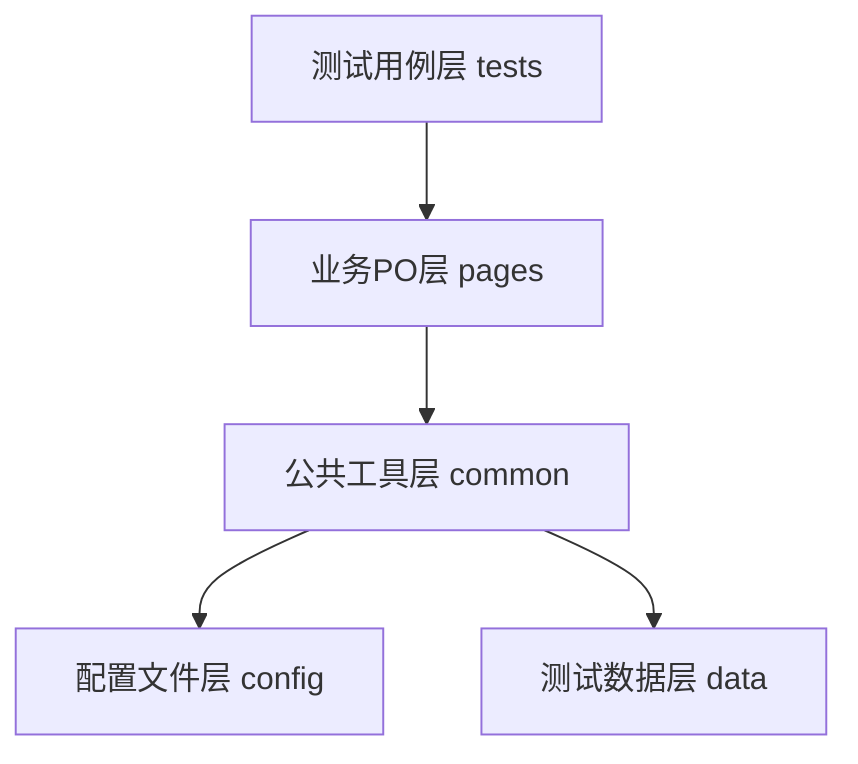

# Playwright UI自动化测试框架
> 最后更新时间：2026年7月 | 版本：v1.0.0


基于 Python + Pytest + Playwright 构建的企业级轻量UI自动化测试框架，复用系统自带 Microsoft Edge 浏览器，从根源规避官方浏览器安装权限拦截问题；内置五层鲁棒性体系，兼容弹窗遮挡、元素动态渲染等不稳定场景；采用 PO 分层设计 + YAML 全量解耦架构，支持多环境切换、数据驱动参数化、多进程并发执行，集成 Allure 可视化报告，代码职责清晰、维护成本低，开箱即用。

## ✨ 核心亮点
- 🛡️ **五层容错体系**：环境层+页面层+操作层+等待层+断言层，大幅提升动态页面用例稳定性
- 🧩 **PO分层架构**：BasePage通用基类 + 业务页面子类，页面改版仅需修改配置
- 🔄 **多环境一键切换**：支持 dev/test/prod 三套环境，命令行参数直接切换
- 📊 **数据驱动参数化**：测试数据外置YAML管理，新增场景无需修改Python代码
- ⚡ **多进程并发执行**：基于pytest-xdist，全量回归耗时缩短60%+
- 📝 **三级用例标签**：冒烟/回归/调试分级管理，适配不同执行场景
- 🖼️ **Allure企业级报告**：步骤分层、失败自动截图、环境元数据自动注入
- 🔒 **敏感配置脱敏**：支持环境变量占位符，账号密钥无需硬编码
- 🚫 **零浏览器安装成本**：复用系统Edge，规避权限拦截，开箱即用

## 🏗️ 架构设计


## 项目简介

## 📦 环境依赖
### 基础运行依赖
- Python 3.13+
- 系统预装 Microsoft Edge（Chromium 内核）
- 完整依赖清单见  `requirements.txt`

### Allure报告额外依赖
- JDK 17+
- Allure CLI 2.x

## 🚀 快速启动
1. 安装依赖
```bash
pip install -r requirements.txt
```

2. 配置环境
 
1. 进入  `config/`  目录，复制  `config.example.yaml`  改名为  `config.yaml` 
​
2. 进入  `config/env/`  目录，复制对应环境的示例模板改名为真实环境文件
​
3. 按需修改浏览器路径、环境地址等配置（路径不填也可自动识别系统Edge）

3. 执行测试
```bash
# 执行冒烟用例（核心主流程）
pytest -m smoke -vs

# 执行全量回归用例
pytest -m regression -vs

# 组合命令：冒烟用例 + 并发执行 + 生成Allure报告
pytest -m smoke -vs -n auto --alluredir=./report/allure-results
```

## 📁 目录结构
```text
  
├── common/             # 公共通用层：全项目复用的基础工具与基类
│   ├── base_page.py    # PO基类，封装通用页面操作与容错能力
│   ├── yaml_reader.py  # YAML配置读取工具，支持缓存、点式路径取值、多环境切换
│   ├── assert_utils.py # 公共断言工具集，统一断言规范
│   └── logger.py       # 标准化日志工具，控制台+文件双输出
├── config/             # 配置文件层：所有可变参数外置
│   ├── env/            # 多环境差异化配置
│   ├── config.yaml     # 全局框架配置
│   └── locators.yaml   # 全环境公共页面元素定位器
├── pages/              # 业务PO层：按页面对象封装业务流程
├── data/               # 测试数据层：YAML格式存储参数化用例数据
├── tests/              # 测试用例层：纯业务断言，不包含底层操作
│   └── draft/          # 草稿调试用例目录（正式执行自动忽略）
├── logs/               # 运行日志输出目录（自动生成）
├── report/             # 测试报告输出目录（自动生成）
├── conftest.py         # 全局Pytest配置：夹具、钩子、命令行参数
├── pytest.ini          # Pytest全局运行配置
├── requirements.txt    # 项目依赖清单
└── README.md           # 项目说明文档
```

## 📖 更多文档
 
- 详细使用说明：见  `DETAILED_USAGE.md` ，包含完整原理、API说明、问题排查
​
- 版本变更记录：见  `CHANGELOG.md` 
​
- 详细命令清单：见  `DETAILED_USAGE.md`  第八章

## ❓ 常见问题
 
1. 浏览器启动失败怎么办？
 
- 确认系统已安装Microsoft Edge浏览器
​
- 配置文件中路径填写正确，或删除路径字段让框架自动识别
​
- 查看日志确认具体报错信息
 
2. Windows终端中文乱码怎么办？
 
执行命令前先切换终端编码：

```bash
chcp 65001
```
 
3. Allure命令找不到？
 
需先安装JDK17与Allure CLI，并配置系统环境变量，详细步骤见  `DETAILED_USAGE.md` 。
 
4. 如何新增业务页面？
 
- 在 `locators.yaml` 新增页面定位器
​
- 在环境配置中补充页面URL
​
- 在 `pages/` 下新建对应PO类继承BasePage
​
- 在 `tests/` 下编写对应测试用例
 
## 📄 License
 
本项目采用 MIT 协议开源，详见  `LICENSE`  文件。
